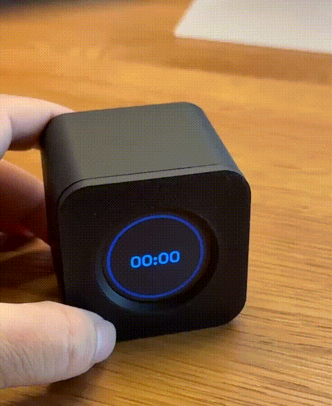
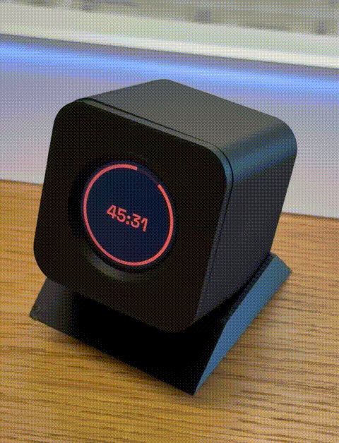

# Kairos

A gravity-triggered desktop Pomodoro / countdown timer. No buttons for the
core interaction — flip the device to a different face to switch what it's
timing, tap it to start or pause. Built on a Waveshare ESP32-S3-LCD-1.28
round display, in modern C++ on ESP-IDF.

Kairos is also a personal practice ground for two things at once: getting
hands-on with embedded C++ on real hardware, and calibrating how well an AI
coding agent (Claude) holds up on a project that grows past a single
session — architecture discipline, whether its design choices survive
contact with real hardware bugs, and how to review its output in a domain
I'm not already fluent in. Every commit that's been verified on real
hardware and authored primarily by the agent is committed under
`Claude Sonnet 5 <noreply@anthropic.com>`, so that history is easy to
filter and read back later (`git log --author="Claude Sonnet 5"`).

## Demo

<!--
  GIF slots — drop files into docs/media/ with these names and uncomment
  the corresponding line. Suggested shots:
    - flip.gif           Rotating the device between faces (A/B/C/D)
    - tap.gif            Tap to start/pause
    - charge.gif         Opening the enclosure / plugging in USB-C to charge
    - battery-check.gif  The pick-up-and-hold battery-check gesture
-->
<!--  -->
<!--  -->
<!--  -->
<!--  -->

## Faces

The device has no fixed "up" — the screen always faces you, and you rotate
it in your hand like a dial. Four quadrants each hold a different timer:

| Face | Mode |
|---|---|
| A | Pomodoro, 25 min focus / 5 min break |
| B | Pomodoro, 50 min focus / 10 min break |
| C | Stopwatch (counts up, no target duration) |
| D | Breathe — a guided 4-7-8 breathing exercise, four rounds that ramp up to the full pattern |

Rotating past a hysteresis threshold switches which face is active and
resets that face's progress. Screen brightness doubles as the notification
channel — it fades during a focus session, snaps back on any interaction,
and ramps up again as a phase is about to end — since there's no speaker or
vibration motor.

**Battery view**: not a fifth face — pick the device up and hold it tilted
out of its normal resting plane for about half a second, and the screen
swaps to a 5-segment battery gauge instead of whatever face was showing.
Set it back down (or lay it flat again) and it returns immediately. The
timer underneath keeps running the whole time.

## Controls

| Gesture | Action |
|---|---|
| Single tap | Start / pause whichever face is currently showing |
| Flip | Rotate to a different face to switch what's being timed |
| Double tap | Wakes the screen from idle sleep (a deliberate two-tap gesture, so an incidental bump won't wake it by accident) |
| Hold BOOT (~3s) | Enters calibration mode, while the device is already running |

## Hardware

- [Waveshare ESP32-S3-LCD-1.28](https://www.waveshare.com/esp32-s3-lcd-1.28.htm) — round 240×240 GC9A01A SPI display, QMI8658 6-axis IMU, ESP32-S3, in one non-touch board.
- One or two 800mAh 1S LiPo cells. Two wired in parallel (~1600mAh combined) is a drop-in upgrade — electrically it's still a single 1S pack to the charger and firmware.

## Battery Life

Measured current draw:

| State | Current |
|---|---|
| Full brightness (paused / just interacted) | ~82mA |
| Dimmed (running, immersion-faded) | ~70mA |
| Idle sleep (light sleep, screen off) | ~800µA |

The firmware also runs a two-stage low-battery safety net — a forced
warning screen first, then automatic deep sleep to protect the cell from
over-discharge if it's left unattended.

Real-hardware endurance test on a single 800mAh cell, kept continuously
active the entire time (never allowed to idle-sleep — the worst case for
power draw): **10 hours 10 minutes** before the low-battery warning
triggered. Day-to-day use, dominated by light sleep between interactions,
runs considerably longer than this.

## Assembly

To be continued.

## Building the Firmware

Requires [ESP-IDF](https://docs.espressif.com/projects/esp-idf/en/stable/esp32s3/get-started/index.html) v6.0 targeting `esp32s3`.

```sh
git submodule update --init --recursive
cd firmware
idf.py set-target esp32s3
idf.py build
idf.py -p <PORT> flash monitor
```

## License

[PolyForm Noncommercial 1.0.0](LICENSE) — free to use and modify for any
noncommercial purpose; commercial use is not permitted.

The primary display font is [Space Grotesk](https://github.com/floriankarsten/space-grotesk),
Copyright 2020 The Space Grotesk Project Authors, licensed under the
[SIL Open Font License 1.1](firmware/main/SpaceGrotesk-OFL.txt).
